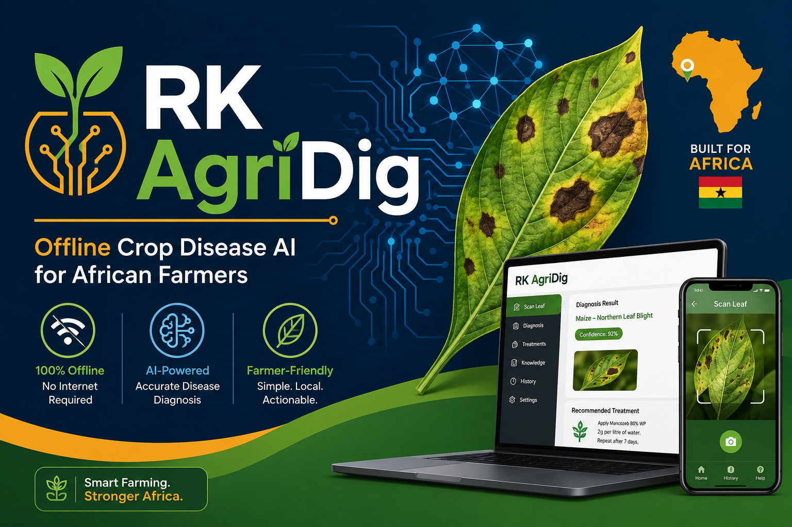

# RK AgriDig

**Offline Crop Disease AI for African Farmers**

An on-device crop disease diagnostic and advisory system for smallholder farmers in Ghana and West Africa. Runs entirely offline on commodity 8GB laptops — no internet, no API costs, no cloud dependency.



## 🌍 The Problem

Smallholder farmers across sub-Saharan Africa lack reliable access to crop disease expertise. When pests or diseases strike, farmers often:
- Cannot diagnose the problem without expert knowledge
- Lack access to actionable treatment advice
- Have no internet to reach cloud-based AI services
- Cannot afford subscription costs ($20+/month API fees)

**Result:** Entire harvests lost to preventable diseases.

## 🚀 The Solution

**RK AgriDig** brings AI-powered crop disease diagnosis directly to farmers' laptops — offline, free, and farmer-friendly.

**Features:**
- 🧐 **Disease Identification** — "What's affecting my crop?"
- 🛠️ **Treatment Advice** — "What can I do to fix it?"
- 🛡️ **Prevention Guidance** — "How do I prevent this next season?"
- 🌐 **Bilingual** — English + Twi (Ghanaian language)
- 📱 **Simple UI** — Gradio web interface, no technical knowledge required
- ⚡ **Fast** — Real-time diagnosis on 8GB RAM hardware

## 📊 Dataset

Built on **GhanaAgricVQA** — a visual question-answering dataset from Ghana with:
- **2,361 Q&A pairs** (train: 2,010 | test: 351)
- **787 images** from real Ghanaian farms (RAIL dataset)
- **3 crops:** Maize, Pepper, Tomato
- **26 disease classes** with expert annotations
- **English + Twi** translations for accessibility

[View dataset on HuggingFace](https://huggingface.co/datasets/GhanaAgricVQA-Dataset)

## 🛠️ Technical Stack

| Component | Technology | Notes |
|-----------|-----------|-------|
| **Model** | Phi-3-mini (3.8B) | Quantized to Q4_K_M GGUF |
| **Inference** | llama.cpp + Ollama | CPU-only, memory-mapped loading |
| **UI** | Gradio | Simple, farmer-friendly web interface |
| **Framework** | Python 3.11+ | Minimal dependencies |
| **Target Hardware** | 8GB DDR4 RAM, integrated GPU | Ubuntu 22.04 LTS |

## 📈 Performance Targets (ADTC Scoring)

| Metric | Target | Notes |
|--------|--------|-------|
| **Accuracy (Sacc)** | 85%+ | Judge-scored model responses on crop diseases |
| **Throughput (Sperf)** | 15+ TPS | Tokens per second on standard hardware |
| **Efficiency (Seff)** | 70%+ | RAM usage below 7GB budget → 100 × ((7 - peak_ram) / 7) |
| **Thermal** | <85°C | No throttling, no disqualification |

## 🚀 Quick Start

### Prerequisites
- Python 3.11+
- 8GB RAM minimum
- 10GB free disk (for model + data)
- Ubuntu 22.04 LTS (reference OS)

### Installation

```bash
# Clone repo
git clone https://github.com/roni-kid/rk-agridig.git
cd rk-agridig

# Create virtual environment
python3 -m venv venv
source venv/bin/activate

# Install dependencies
pip install -r requirements.txt

# Download Phi-3-mini GGUF model
python models/download_model.py

# Run setup
bash setup.sh
```

### Run the UI

```bash
# Start Ollama server (in background)
ollama serve &

# Launch Gradio app
python ui/app.py
```

Then open `http://localhost:7860` in your browser.

### Example Query

**User input:**
```
My pepper leaves have brown spots with yellow halos. What disease is this?
```

**Model output:**
```
This appears to be Bacterial Spot, a common pepper disease in West Africa.

Treatment:
1. Remove affected leaves immediately
2. Apply copper-based fungicide (e.g., Bordeaux mixture)
3. Spray every 7-10 days until controlled
4. Ensure good air circulation

Prevention for next season:
- Use disease-free seeds/seedlings
- Practice crop rotation (avoid planting peppers in same soil)
- Remove plant debris after harvest
```

## 📋 Files & Structure

- **`README.md`** — This file
- **`REPORT.md`** — Technical report for Africa Deep Tech Challenge 2026
- **`PROMPTS.md`** — AI usage log (per competition rules)
- **`src/`** — Core Python modules
  - `prompt_engineer.py` — System prompts & Q&A templates
  - `evaluator.py` — Accuracy evaluation (BLEU, semantic similarity)
  - `benchmarker.py` — Performance profiling (TPS, RAM)
- **`data/`** — GhanaAgricVQA dataset (train/test splits)
- **`models/`** — Phi-3-mini GGUF (quantized, ~2.3GB)
- **`ui/`** — Gradio web interface
- **`benchmarks/`** — Performance results & thermal monitoring
- **`docs/`** — Setup, usage, and architecture guides

## 🧪 Evaluation & Benchmarking

### Accuracy Testing

```bash
python src/evaluator.py --dataset data/eval_samples.json --model models/phi3_mini_4k_instruct.gguf
```

Outputs accuracy metrics using BLEU and semantic similarity against reference answers from GhanaAgricVQA.

### Performance Profiling

```bash
bash benchmarks/run_profiler.sh
```

Measures:
- **Tokens per second (TPS)** via llama-bench
- **Peak RAM usage** during inference
- **CPU temperature** to ensure <85°C
- **Latency** (prompt processing + generation)

### Thermal Monitoring

```bash
python benchmarks/thermal_monitor.py --duration 300
```

Logs CPU temperature every 5 seconds during inference to prevent throttling penalties.

## 🌱 Design Decisions

### Why Phi-3-mini?

1. **Size:** 3.8B parameters fits comfortably in 8GB with Q4_K_M quantization (~2.3GB)
2. **Quality:** Instruction-tuned, strong performance on reasoning tasks (disease diagnosis)
3. **Speed:** 15+ TPS on CPU-only hardware (meets ADTC throughput target)
4. **Community:** Well-documented, GGUF quantization proven stable

### Why Q4_K_M Quantization?

- **Accuracy:** Minimal quality loss vs. full precision (K-quant strategy preserves important weights)
- **Memory:** ~2.3GB peak RAM during inference
- **Speed:** 4-bit quantization provides good TPS on CPU

### Why Ollama + llama.cpp?

- **Simplicity:** One-command model serving (`ollama serve`)
- **Efficiency:** Memory-mapped loading prevents preloading full weights
- **Standards:** OpenAI-compatible API for easy integration
- **Transparency:** No cloud calls, full offline capability

## 📊 Competition Context

This project is built for the **Africa Deep Tech Challenge 2026** — a hackathon focused on making useful AI run on the actual hardware African users own (8GB commodity laptops, not expensive edge devices).

**Scoring (50/30/20 split):**
- **50%** Model Accuracy & Quality (Sacc)
- **30%** Throughput Performance (Sperf)
- **20%** Memory Efficiency (Seff)
- **Bonus** African Use Case (up to +10 points)
- **Penalty** Thermal throttling or OOM (-10 points)

**Timeline:**
- **Aug 25** — Gate 1: Proposal + prototype deadline
- **Sept 22** — Semifinal submission deadline
- **Oct 17** — Live defense & winners announced

## 🤝 Contributing

This is a solo project for ADTC 2026, but feedback and improvements are welcome after the competition.

## 📜 License

This project is released under **CC-BY 4.0** to match the GhanaAgricVQA dataset license.

### Citation

```bibtex
@misc{rk_agridig_2026,
  title={RK AgriDig: Offline Crop Disease Diagnostic for African Smallholder Farmers},
  author={Aaron Baidoo (RoniKid)},
  year={2026},
  publisher={GitHub},
  url={https://github.com/roni-kid/rk-agridig}
}
```

Dataset citation:
```bibtex
@misc{ghanaagrivqa2026,
  title={GhanaAgricVQA: Crop Disease Visual Question Answering Dataset},
  author={Toufiq Musah, Nyameye Akyaa Idun-Sam, Abotsi Benjamin Etornam},
  year={2026},
  publisher={Hugging Face},
  url={https://huggingface.co/datasets/GhanaAgricVQA-Dataset}
}
```

## 📞 Contact

Built by Aaron and Firdaus

- GitHub: [@roni-kid](https://github.com/roni-kid) & [Kudus Firdaus](https://github.com/KudusFirdaus)
- LinkedIn: [Aaron Baidoo](https://linkedin.com/in/aaronbaidoo) & [Firdaus Kudus](https://www.linkedin.com/in/firdaus-kudus-735864387/)

---

**"Building AI for the hardware Africa actually has."**
